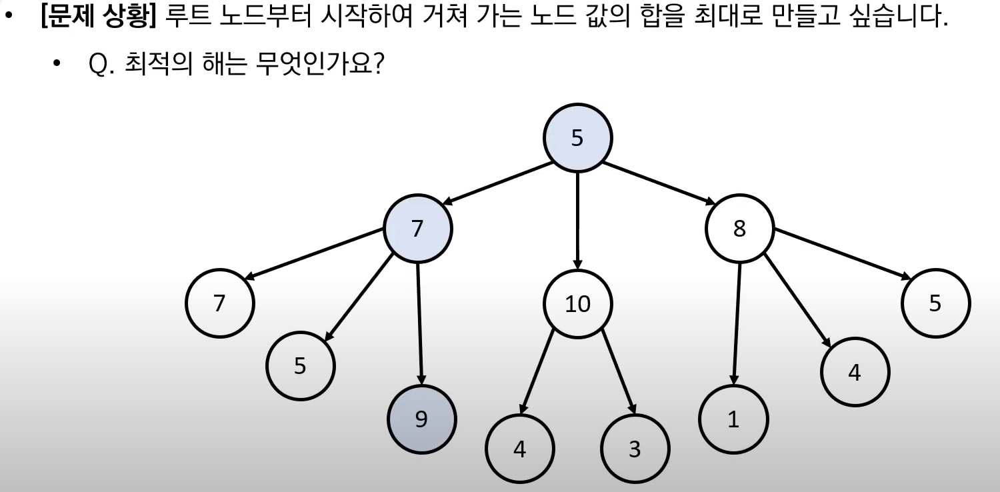
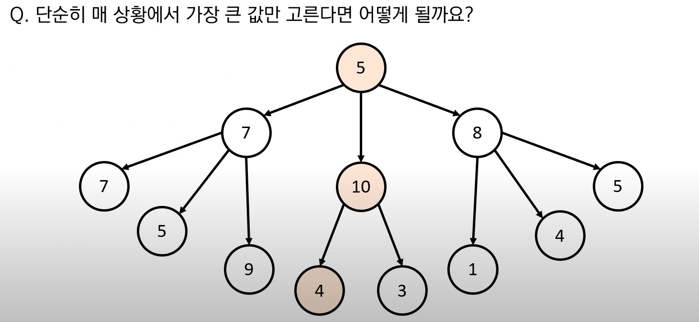

## 그리디 알고리즘
- 현재 상황에서 지금 당장 좋은 것만 고르는 방법
- 해답에 대한 정당성 분석이 중요함

### 예시

- 최적의 해는 5 + 7 + 9 = 21이다.

- 하지만 매 상황에서 단순히 큰 값만 고른다면?
  - 시작 노드 5의 인접 노드 7, 10, 8 중 10을 선택
  - 두번째 노드 10의 인접 노드 4, 3 중 4를 선택
  - 결과적으로 5 + 10 + 4 = 19로 최적의 해가 되지 못한다.

- 위 예시처럼 그리디 알고리즘이 최적의 해를 보장할 수 없는 경우가 많다.


## 문제 풀이
### 1. 거스름돈 문제
#### 문제
- 거스름돈으로 사용할 500원, 100원, 50원, 10원짜리 동전이 무한히 존재한다고 가정
- 손님에게 거슬러 줘야할 돈이 N원 (N은 항상 10의 배수)
- 이때의 최소 동전 수는?

#### 해결 방법
- 가장 큰 화폐 단위부터 거슬러준다.
- 정당성 검증 : 큰 단위가 항상 작은 단위의 배수이므로 정당한 방법이다!

```python
n = 1260
count = 0

# 화폐 단위를 큰 단위부터 차례로 확인
array = [500, 100, 50, 10]

for coin in array:
    count += n // coin # 해당 화폐로 거슬러 줄 수 있는 동전의 개수 세기
    n %= coin

print(count)
```

- 화폐의 종류가 K라고 할 때, 소스코드의 시간 복잡도는 O(K)이다.
- 이 알고리즘의 시간 복잡도는 거슬러줘야 하는 금액과는 무관하며, 동전의 총 종류에만 영향을 받는다.


### 2. 1이 될 때까지
- 어떠한 수 N이 1이 될 때까지 다음의 두 과정 중 하나를 반복적으로 선택하여 수행
- 단, 두 번째 연산은 N이 K로 나누어 떨어질 때만 선택할 수 있다.
  1. N에서 1을 뺀다.
  2. N을 K로 나눈다.
- 예를 들어, N이 17, K가 4라고 가정하자. 이때 1번의 과정을 한 번 수행하면 16, 이 후 2번 과정을 두 번 수행하면 N은 1이 된다. 
   => N이 1이 되는 최소 횟수: 3회
- N과 K가 주어질 때 N이 1이 될 때까지 1번 또는 2번 과정을 수행해야 하는 최소 횟수를 구하는 프로그램을 작성하라.
- [문제 링크](https://www.youtube.com/watch?v=_TG0hVYJ6D8&list=PLVsNizTWUw7H9_of5YCB0FmsSc-K44y81&index=13)


#### 문제 풀이
- 최대한 많이 나누기 수행
- 1을 빼는 것보다 나누는 것이 더 많은 수를 줄일 수 있다.
- 정당성 분석 : K가 2이상 이라면, K로 나누는 것이 1을 빼는 것보다 항상 빠르게 N을 줄일 수 있다.
```python
N, K = map(int, input().split())

count = 0

def sub():
    global N
    N = N-1

def div():
    global N
    N = N//K

for _ in range(N):  
    if N % K == 0:
      div()
    else:
      sub()
    count+=1
    
    if N == 1:
      break
    
print(count)

```


