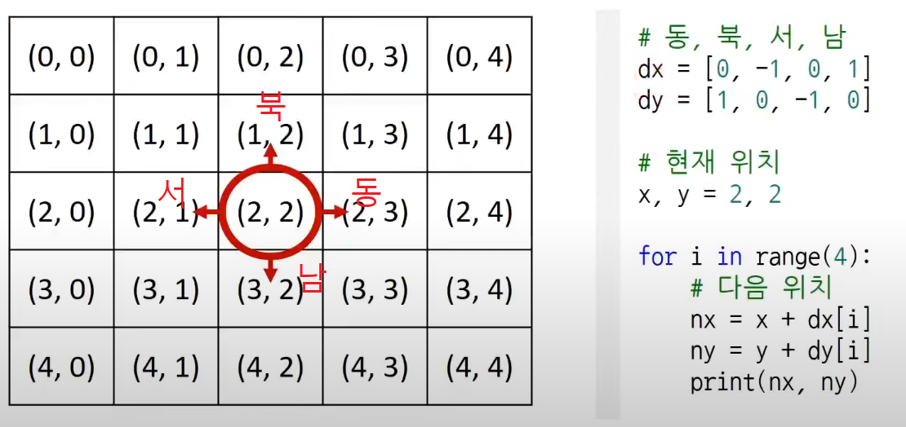

## 구현
- 알고리즘 대회에서 풀이를 떠올리긴 쉽지만 코드로 옮기기 어려운 문제
- 2차원 공간 => 행렬로 표현 

- 시뮬레이션 및 완전 탐색 문제에서는 2차원 공간에서의 방향 벡터가 자주 활용됨
```python
# 동 북 서 남
dx = [0, -1, 0, 1]
dy = [1, 0, -1, 0]

# 현재 위치
x, y = 2, 2

for i in range(4):
    #다음 위치
    nx = x + dx[i]
    ny = y + dy[i]
    print(nx, ny)
```



