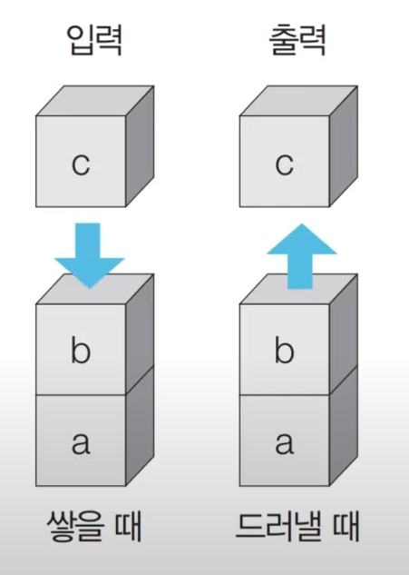

## DFS & BFS
- 대표적인 그래프 탐색 알고리즘

## Stack : 스택 자료구조
- 선입후출 LIFO



```python
stack = []

stack.append(5) # 5 삽입
stack.append(2) # 2 삽입
stack.append(3) # 3 삽입
stack.append(7) # 7 삽입
stack.pop() # 7 삭제
stack.append(1) # 1 삽입
stack.append(4) # 4 삽입
stack.pop() # 4 삭제

print(stack[::-1]) # [1, 3, 2, 5] 최상단 원소부터 출력
print(stack)    # [5, 2, 3, 1] 최하단 원소부터 출력
```

## Queue : 큐 자료구조
- 선입선출 FIFO


- 직접 구현할 수도 있지만, 시간복잡도가 높아질 가능성이 크다
- Queue를 구현할 때는 deque 라이브러리를 사용하자.
```python
from collections import deque

queue = deque()

queue.append(5) # 5 삽입
queue.append(2) # 2 삽입
queue.append(3) # 3 삽입
queue.append(7) # 7 삽입
queue.popleft() # 5 삭제
queue.append(1) # 1 삽입
queue.append(4) # 4 삽입
queue.popleft() # 2 삭제

print(queue) # deque([3, 7, 1, 4]) 먼저 들어온 순서대로 출력
queue.reverse() # 역순으로 바꾸기
print(queue) # deque([4, 1, 7, 3]) 나중에 들어온 원소부터 출력
```
