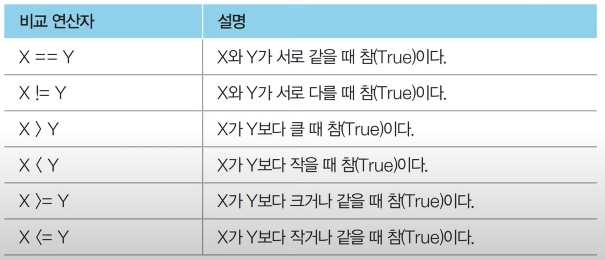
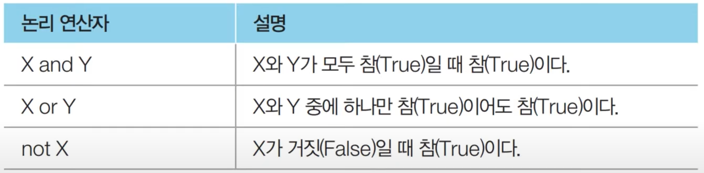
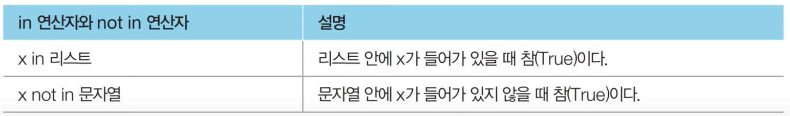

## 조건문
- 기본 형태 : if ~ elif ~ else
```python
x = 15
if x >= 10:
    print("10 이상")
elif x >= 0:
    print("0 이상")
else:
    print("0 미만")
```
```python
score = int(input());
if score >= 90:
    print("A")
elif score >= 80:
    print("B")
elif score >= 70:
    print("C")
else:
    print("D")
```

### 조건문 간소화
- 소스코드가 한줄이면 줄바꿈을 하지 않아도 됨
```python
score = 85
if score >= 80: result = "Success"
else: result = "Fail"
```
- 조건부 표현식(Conditional Expression)
```python
score = 85
result = "Success" if score >= 80 else "Fail"
```

### 부등식
- 수학의 부등식을 그대로 사용 가능함
```python
x = 15
if x > 0 and x < 20:
    print("0 < x < 20")

if 0 < x < 20:
    print("0 < x < 20")
```


## 비교 연산자


## 논리 연산

```python
if True or False:
    print("True")

a= 15
if a <= 20 and a >= 0:
    print("YES")
```

## 기타 연산자
### in, not


### pass
- 아무것도 처리하고 싶지 않을 때 pass 키워드 사용
```python
score = 85
if score >= 80:
    pass # 나중에 작성할 코드
else:
    print("성적이 80점 미만")

print("프로그램 종료")


```

## Tip
### 들여쓰기
- 파이썬에서는 코드의 블록을 들여쓰기로 지정
- 들여쓰기 : 4개의 공백문자