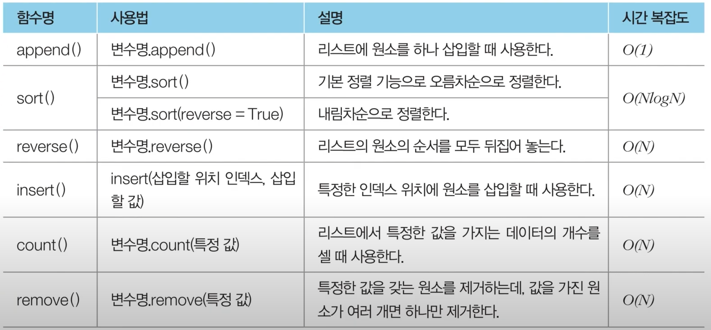

## 리스트 자료형
- 데이터 연속적으로 담는 자료형
- 배열 또는 테이블이라고도 불림
- C언어의 배열(Array), 연결 리스트와 유사한 기능 지원
- C++의 STL vector와 유사
- 비어있는 리스트 선언 : `list()` 또는 `[]`

### 초기화
```python
# 초기화 : 데이터 직접 입력
a = [1, 2, 3, 4, 5, 6, 7, 8, 9]
print(a) 

# 모든 원소 0으로 초기화(1차원 리스트)
n = 10
b = [0] * n
print(b)
```

### Comprehension
- 리스트 초기화하는 방법 중 하나
- 조건문, 반복문 활용
```python
# 0부터 9까지의 수 포함하는 리스트
array1 = [i for i in range(10)]

# 0부터 19까지 홀수만 포함하는 리스트
array2 = [i for i in range(20) if i % 2 == 1]

# 1부터 9까지 수들의 제곱 값을 포함하는 리스트
array3 = [i*i for i in range(1,10)]
```

#### 일반적인 코드와 비교
```python
# 일반적인 코드
array = []
for i in range(20):
    if i % 2 == 1:
        array.append(i)
```

#### 2차원 리스트 초기화
```python
# N X M 크기의 2차원 리스트 초기화
n = 4
m = 3
array1 = [[0]*m for _ in range(n)]

# 잘못된 예시
array2 = [[0]*m]*n # 리스트 안에 포함된 각 리스트는 모두 같은 객체로 인식하게 됨
array2[1][1] = 5

'''
아래처럼 이상한 결과가 나옴
0 5 0
0 5 0
0 5 0
0 5 0
'''
```

### Indexing
- 리스트의 특정 원소에 접근
```python
# Indexing : 인덱스 이용한 원소 출력
a = [1, 2, 3, 4, 5, 6, 7, 8, 9]

print(a[3]) # 4 네 번째 원소
print(a[-1]) # 9 뒤에서 첫 번째 원소
```

### Slicing
- 리스트에서 연속적인 위치의 원소들에 접근
```python
a = [1, 2, 3, 4, 5, 6, 7, 8, 9]

print(a[1:4]) # [2, 3, 4] 두 번째 원소 ~ 네 번째 원소
```

### methods for list


```python
a = [1, 4, 3]

# 삽입
a.append(2)

# 오름차순 정렬
a.sort()

# 내림차순 정렬
a.sort(reverse= True)

# 뒤집기
a.reverse()

# 특정 인덱스에 데이터 추가
a.insert(2, 3) # 인덱스 2에 3 추가

# 특정 데이터 개수 세기
a.count(3)

# 특정 값 데이터 삭제
a.remove(1)
```

```python
b = [1, 2, 3, 4, 5, 5, 5]
remove_set = {3, 5} # 집합 자료형

# remove_list에 포함되지 않은 값만을 저장
result = [i for i in b if i not in remove_set]
print(result) # [1, 2, 4]
```


